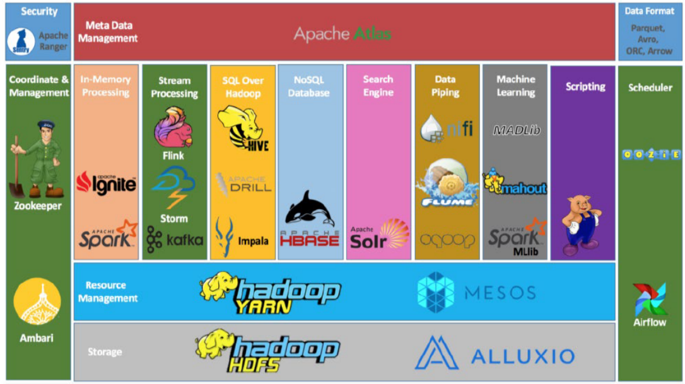
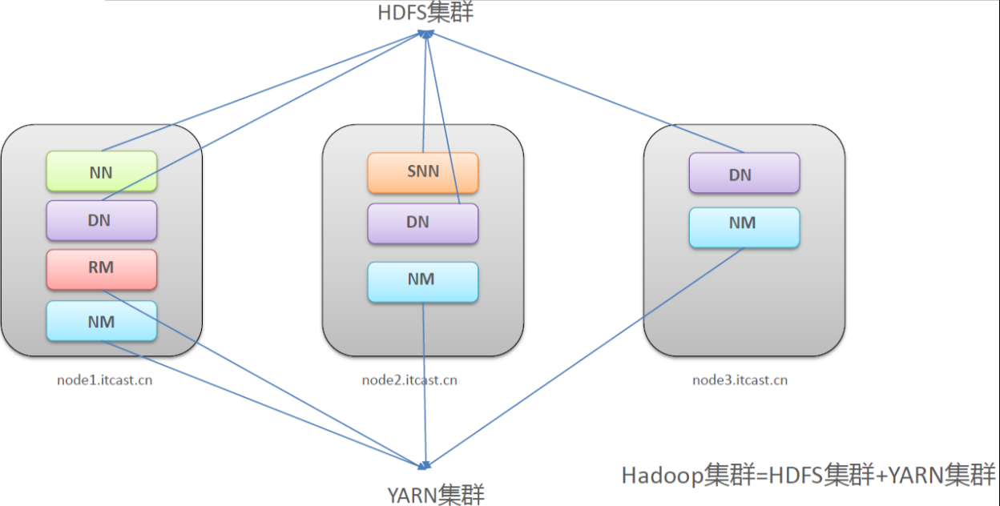
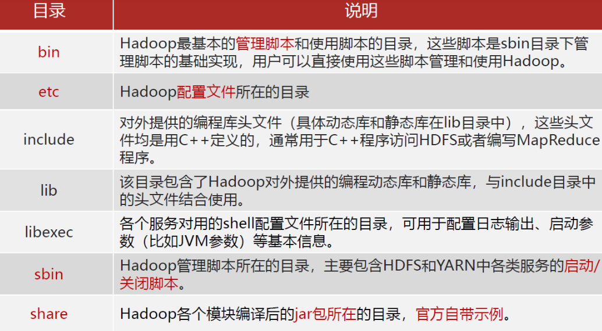
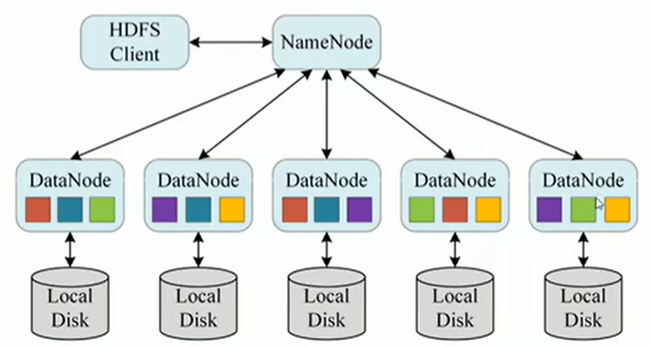
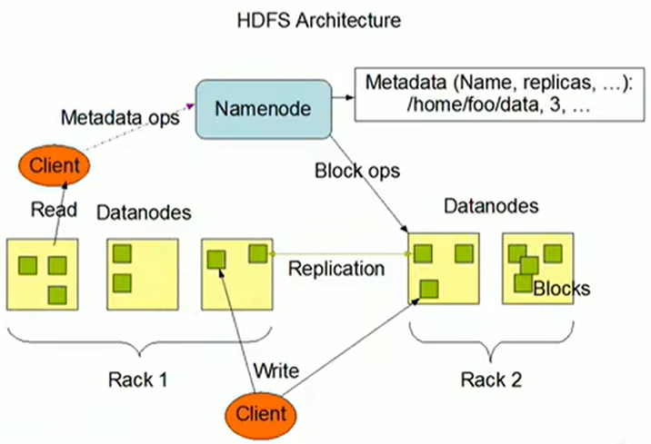
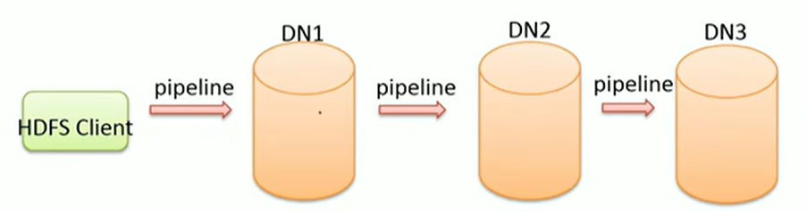
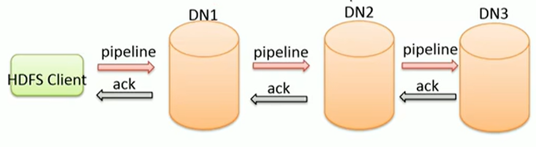
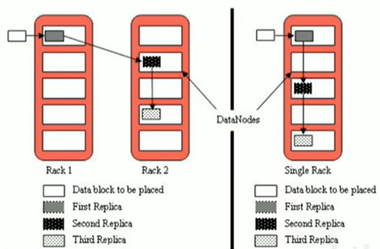
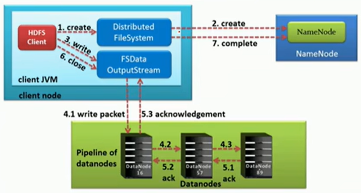
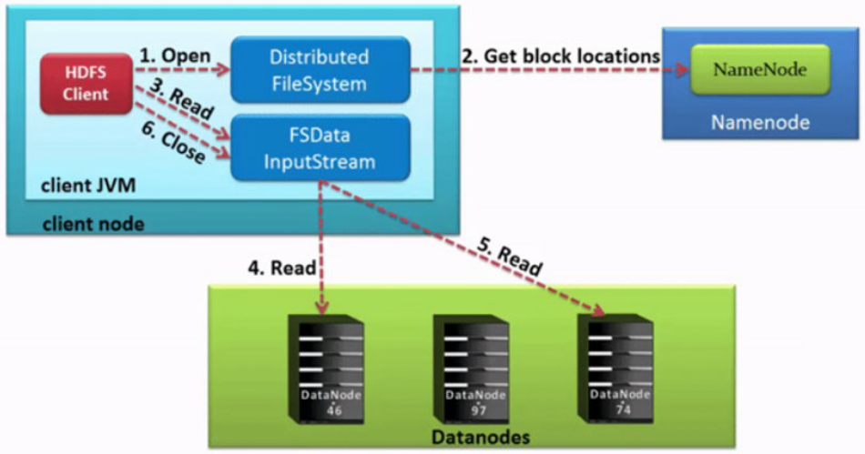

# Hadoop
## 導論
### 數據
對客觀事務的計量和記錄產生數據，而數據分析在日常經營分析中有三大方向：
1. 現狀分析：分析當下的數據；現階段的整體情況，各個部份的構成占比、發展、變動。
    * 即時分析（Real Time Processing | Streaming） 面向當下，分析即時產生的數據；所謂的即時是指從數據產生到數據分析與數據應用的時間間隔很短，可細分秒級、毫秒級。即時分析又稱為串流處理（Streaming）。
2. 原因分析：分析過去的數據；某一現況為什麼發勝，確定原因、做出調整優化。
    * 離線分析（Batch Processing）：面向過去，面向歷史，分析現有的數據；在時間維度明顯成批次性變化。一週一分析（T+7），一天一分析（T+1），所以也叫做批次。
3. 預測分析：結合已有數據預測未來發展趨勢。
    * 機器學習（Machine Learning）：基於歷史數據和當下產生的即時數據預測未來發生的事情；著重於數學演算法的運用，如分類、聚類、關聯、預測。

### 數據分析
六步驟
1. 明確分析的目的和思路：
    * 目的是整個分析流程的起點，為數據的收集、處理及分析提供清晰的指引方向。
    * 思路是使分析框架體系化，例如先分析什麼，後分析什麼，使各分析點之間具有邏輯聯繫，保證分析維度的完整性，分析結果的有效性以及正確性，需要數據分析方法論來支撐。
    * 數據分析方法論是一些行銷管理相關理論，例如使用者行為理論、PEST分析法、5W2H分析法等。
2. 數據收集：
    * 數據從無到有的過程：例如感測器收集氣象數據、埋點收集使用者行為數據。
    * 數據傳輸搬運的過程：例如採集資料庫資料到數據分析平台。
    * 常見的數據來源和種類：業務數據（RDBMS）、日誌數據（伺服器、應用程式日誌）、爬蟲數據（爬蟲資料庫）、網路公開數據（產業、政府網站）。
3. 數據處理：
    * 準確來說，應該稱之為數據預處理。
    * 數據預處理需要將收集到的數據進行加工整理，形成適合數據分析的樣式，主要包括數據清洗、數據轉換、數據擷取、數據計算。
    * 數據預處理可以確保數據的一致性和有效性，讓數據變成乾淨規則的結構化數據。
4. 數據分析：
    * 用適當的分析方法及分析工具，對處理過的數據進行分析，提取有價值的信息，形成有效結論的過程。
    * 需要掌握各種數據分析方法，也要熟悉數據分析軟體的操作。
5. 數據展現：
    * 數據展現又稱之為數據視覺化，指的是分析結果圖表展示，因為人類是視覺動物。
    * 數據視覺化（Data Visualization）屬於數據應用的一種。
    * 請注意，數據分析的結果不是只有視覺化展示，還可以繼續數據探勘（Data Mining）、即席查詢（Ad Hoc）等。
6. 報告撰寫：
    * 數據分析報告是整個數據分析結過程的一個總結與呈現。
    * 把數據分析的起因、過程、結果及建議完整地呈現出來，供決策者參考。
    * 需要有明確的結論，最好有建議或解決方案。

### 大數據
大數據（big data）是指無法在一定時間範圍內用常規軟體工具進行捕捉、管理和處理的數據集合；是需要新處理模式才能具有更強的決策力、洞察發現力和流程優化能力的海量、高成長率和多樣化的資訊資產。

5V特徵
* Volume：數據體積大。擷取數據量大；儲存數據量大；計算數據量大；TB、PB等級起步。
* Variety：種類、來源多樣化。種類：結構化、半結構化、非結構化；來源：日誌文字、圖片、音訊、視頻。
* Value：低價值密度。資訊海量但是價值密度低；深度複雜的挖掘分析需要機器學習參數。
* Velocity：速度快。數據成長速度快；取得數據速度快；數據處理速度快。
* Veracity：數據的質量。數據的準確性 數據的可信賴度。

### 分布式與集群
分散式是指：多台機器，每台機器上部署不同元件。
集群是指：多台機器，每台機器上部署相同組件。

數據大爆炸，海量數據處理場景面臨問題：
如何儲存？單機儲存有瓶頸，多台機器分散式儲存。
如何計算（高效率）？單台運算能力有限，多台機器分散式計算。

## 簡介
Hadoop允許使用者使用簡單的程式設計模型實現跨機器集群，對海量數據進行分散式計算處理。
Hadoop核心元件：
1. Hadoop HDFS（分散式檔案儲存系統）：解決海量數據存儲。
2. Hadoop YARN（集群資源管理與任務排程框架）：解決資源任務調度。
3. Hadoop MapReduce（分散式運算框架）：解決大量數據計算。

廣義Hadoop指的是圍繞Hadoop打造的大數據生態圈。


現狀：
1. HDFS作為分散式檔案儲存系統，處在生態圈的底層和核心位置。
2. YARN作為分散式通用的集群資源管理系統和任務調度平台，支援各種運算引擎運行，保證了Hadoop地位。
3. MapReduce作為大數據生態圈第一代分散式運算引擎，由於自身設計的模型所產生的弊端，導致企業一線幾乎不再直接使用MapReduce進行程式設計處理，但是很多軟體的底層依然在使用MapReduce引擎來處理數據。

Hadoop特性：
* scalability：擴容能力強：Hadoop是在可用的電腦集群間分配數據並完成計算任務的，這些集群可方便靈活的方式擴展到數以千計的節點。
* economical：成本低：Hadoop集群允許透過部署普通廉價的機器組成集群來處理大數據，以至於成本很低。看重的是集群整體能力。
* efficiency：效率高：透過併發數據，Hadoop可以在節點之間動態併行的移動數據，使得速度非常快。
* reliability：可靠性高：能自動維護數據的多份複製，且在任務失敗後能自動重新部署（redeploy）運算任務。所以Hadoop的位元儲存和處理數據的能力值得人們信賴。

集群概述：
* Hadoop集群包含兩個集群（實體層面）：HDFS集群、YARN集群。
* 兩個集群邏輯上分離、通常物理在一起。兩個集群之間互相沒有依賴、互不影響，某些角色進程卻通常部署在同一台實體伺服器上。
* 兩個集群都是標準的主從架構集群。
* MapReduce是計算框架、程式碼層面的元件，沒有集群之說。

HDFS集群是一個分散式儲存系統，它當中的主角色叫做NameNode，簡稱NN，從角色叫做DataNode，簡稱DN，主角色輔助角色叫做SecondaryNameNode，簡稱SNN。
YARN集群主要負責資源管理與任務調度，它當中的主角色叫做ResourceManager，簡稱RM，從角色稱為NodeManager，簡稱NM。


## 安裝
使用三台虛擬機，彼此的腳色也如上圖。
Hadoop在此使用3.3.0版本、且須搭配Java8。https://archive.apache.org/dist/hadoop/common/hadoop-3.3.0/
使用官方編譯後的tar.gz。若要符合不同作業系統本機庫環境，Hadoop某些操作例如壓縮、IO需要呼叫系統本地庫，則安裝原碼src.tar.gz再做編譯。

### 基礎環境準備
1. 三台虛擬機互相配置hostname node1、node2、node3
2. ssh免密登入（只需設定node1至node1、node2、node3即可）
```shell=
ssh-keygen #接下來直接按enter直到生成密鑰即可。
ssh-copy-id node1
ssh-copy-id node2
ssh-copy-id node3
```


3. 創建統一工作目錄，三台VM皆是
```shell=
mkdir -p /export/server/   #軟件安裝路徑
mkdir -p /export/data/     #數據存儲路徑
mkdir -p /export/software/ #安裝包存放路徑
```

4. 確保有安裝jdk
5. 將tar.gz上傳到/export/server目錄
6. `tar -zxvf /export/server/hadoop-3.3.0.tar.gz`解壓安裝包
7. `rm -zxvf /export/server/hadoop-3.3.0.tar.gz`刪除安裝包



### 配置文件
官方文件：https://hadoop.apache.org/docs/r3.3.0/
* 第一類1個：hadoop-env.sh
* 第二類4個：xxxx-site.xml，site表示的是使用者定義的配置，會覆寫default中的預設配置。
    * core-site.xml 核心模組配置
    * hdfs-site.xml hdfs檔案系統模組配置
    * mapred-stie.xml MapReduce模組配置
    * yarn-site.xml yarn模組配置
* 第三類1個：workers
* 所有的設定檔目錄：/export/server/hadoop-3.3.0/etc/hadoop

1. `cd /export/server/hadoop-3.3.0/etc/hadoop`
2. 修改hadoop-env.sh
```shell=
#文件最後添加
export JAVA_HOME=... #申明java的路徑

#指定各個進程的用戶名
export HDFS_NAMENODE_USER=root
export HDFS_DATANODE_USER=root
export HDFS_SECONDARYNAMENODE_USER=root
export YARN_RESOURCEMANAGER_USER=root
export YARN_NODEMANAGER_USER=root 
```
3. 修改core-site.xml：主要配一些通用核心的配置
```shell=
# 插入到<configuration>中
<!-- 設置默認使用的文件系統；Hadoop支持file、HDFS、GFS、ali|Amazon雲等文件系統 -->
<property>
    <name>fs.defaultFS</name>
    <value>hdfs://node1:8020</value>
</property>

<!-- 設置Hadoop本地保存數據路徑 -->
<property>
    <name>hadoop.tmp.dir</name>
    <value>/export/data/hadoop-3.3.0</value>
</property>

<!-- 設置HDFS web UI用戶身份 -->
<property>
    <name>hadoop.http.staticuser.user</name>
    <value>root</value>
</property>

<!-- 整合hive 用戶代理設置 -->
<property>
    <name>hadoop.proxyuser.root.hosts</name>
    <value>*</value>
</property>

<property>
    <name>hadoop.proxyuser.root.groups</name>
    <value>*</value>
</property>

<!-- 文件系統垃圾桶保存時間 -->
<property>
    <name>fs.trash.interval</name>
    <value>1440</value>
</property>
```
4. 修改hdfs-site.xml：檔案系統的核心配置
```shell=
# 插入到<configuration>中
<!-- 設置SNN進程運行機器位置信息 -->
<property>
    <name>dfs.namenode.secondary.http-address</name>
    <value>node2:9868</value>
</property>
```
5. 修改mapred-stie.xml：MapReduce模組配置
```shell=
# 插入到<configuration>中
<!-- 設置MR程序默認運行模式： yarn集群模式 local本地模式 -->
<property>
  <name>mapreduce.framework.name</name>
  <value>yarn</value>
</property>

<!-- MR程序歷史服務地址 -->
<property>
  <name>mapreduce.jobhistory.address</name>
  <value>node1:10020</value>
</property>
 
<!-- MR程序歷史服務器web端地址 -->
<property>
  <name>mapreduce.jobhistory.webapp.address</name>
  <value>node1:19888</value>
</property>

<property>
  <name>yarn.app.mapreduce.am.env</name>
  <value>HADOOP_MAPRED_HOME=${HADOOP_HOME}</value>
</property>

<property>
  <name>mapreduce.map.env</name>
  <value>HADOOP_MAPRED_HOME=${HADOOP_HOME}</value>
</property>

<property>
  <name>mapreduce.reduce.env</name>
  <value>HADOOP_MAPRED_HOME=${HADOOP_HOME}</value>
</property>
```
6. 修改yarn-site.xml
```shell=
# 插入到<configuration>中
<!-- 設置YARN集群主角色運行機器位置 -->
<property>
	<name>yarn.resourcemanager.hostname</name>
	<value>node1</value>
</property>

<property>
    <name>yarn.nodemanager.aux-services</name>
    <value>mapreduce_shuffle</value>
</property>

<!-- 是否將對容器實施物理內存限制 -->
<property>
    <name>yarn.nodemanager.pmem-check-enabled</name>
    <value>false</value>
</property>

<!-- 是否將對容器實施虛擬內存限制。 -->
<property>
    <name>yarn.nodemanager.vmem-check-enabled</name>
    <value>false</value>
</property>

<!-- 開啟日志聚集 -->
<property>
  <name>yarn.log-aggregation-enable</name>
  <value>true</value>
</property>

<!-- 設置yarn歷史服務器地址 -->
<property>
    <name>yarn.log.server.url</name>
    <value>http://node1:19888/jobhistory/logs</value>
</property>

<!-- 歷史日志保存的時間 7天 -->
<property>
  <name>yarn.log-aggregation.retain-seconds</name>
  <value>604800</value>
</property>
```
7. 修改wokers：配置集群的「工人」位於的機器ip訊息
```shell=
#刪除原來的localhost
node1
node2
node3
```
8. 添加環境變量
```shell=
vim /etc/profile

#追加以下
export HADOOP_HOME=/export/server/hadoop-3.3.0
export PATH=$PATH:$HADOOP_HOME/bin:$HADOOP_HOME/sbin

#驗證，退出文件編輯
hadoop
#有跑出內容即可
```

9. NameNode format在node1執行
首次啟動HDFS時，必須對其進行格式化操作。
format本質上是初始化工作，進行HDFS清理和準備工作
在node1執行、因為NN在node1：`hdfs namenode -format`

### 啟動
1. 手動逐一進程啟停：每台機器上每次手動啟動關閉一個角色進程，可以精準控制每個進程啟停，避免群起群停。
    * HDFS集群`hadoop --daemon start|stop namenode|datanode|secondarynamenode`
    * YARN集群`yarn --daemon start|stop resourcemanager|nodemanager`
2. shell腳本一鍵啟動停止：在node1上，使用軟體內建的shell腳本一鍵啟動。前提：設定好機器之間的SSH免密登入和workers檔案。啟動後用jps驗證結果。
    * HDFS集群 `start-dfs.sh` `stop-dfs.sh`：node1會有NameNode/DataNode、node2會有SecondaryNameNode/DataNode、node3會有DataNode
    * YARN集群 `start-yarn.sh` `stop-yarn.sh`：node1會有NodeManager/ResourceManager、node2會有NodeManager、node3會有NodeManager
    * Hadoop集群 `start-all.sh` `stop-all.sh`：結合以上

HDFS集群的Web頁面 網址：http://namenode_host:9870 其中namenode_host是namenode運作所在機器的主機名稱或ip。這裡我們用node1:9870可以存取HDFS的Web頁面。
YARN集群的Web頁面 網址：http://resourcemanager_host:8088 其中resourcemanager_host是resourcemanager運作所在機器的主機名稱或ip。這裡我們用node1:8088可以存取YARN的Web頁面。

### 初體驗
在node1操作

HDFS初體驗
```shell=
hadoop fs -mkdir /mytest
hadoop fs -put 要上傳的文件 /mytest
hadoop fs -ls /
```

MapReduce+YARN初體驗 執行Hadoop官方自帶的MapReduce案例，評估圓周率π的值。
```shell=
cd /export/server/hadoop-3.3.0/share/hadoop/mapreduce/
hadoop jar hadoop-mapreduce-examples-3.3.0.jar pi 2 4
```

## HDFS分布式文件系统
Hadoop Distributed File System
### 簡介
文件系統定義
* 文件系統是一種儲存和組織資料的方法，實現了資料的儲存、分級組織、存取和取得等操作，使得使用者對文件存取和查找變得容易
* 文件系統使用樹狀目錄的抽象邏輯概念取代了硬碟等實體裝置使用資料區塊的概念，使用者不必關心資料底層存在硬碟哪裡，只需要記住這個文件的所屬目錄和文件名稱即可
* 文件系統通常使用硬碟和光碟這樣的儲存設備，並維護文件在設備中的實體位置。

文件系統中有兩個概念非常重要：
1. 數據：指儲存的內容本身，例如文件、影片、圖片等，這些資料底層最終是儲存在磁碟等儲存媒體上的，一般使用者無需關心，只需要基於目錄樹進行增刪改查即可，實際針對資料的操作由文件系統完成。
2. 元數據（metadata）：又稱之為解釋性數據，記錄數據的數據；文件系統元數據一般指檔案大小、最後修改時間、底層儲存位置、屬性、所屬使用者、權限等資訊。

海量資料儲存遇到的問題
* 成本高：傳統儲存硬體通用性差，設備投資加上後期維護、升級擴容的成本非常高。
* 如何支撐高效率的計算分析：傳統儲存方式意味著儲存是存儲，計算是計算，當需要處理資料的時候把資料移動過來。程序和資料儲存是屬於不同的技術廠商實現，無法有機統一整合在一起。
* 性能低：單節點I/O效能瓶頸無法逾越，難以支撐大量資料的高併發高吞吐場景。
* 可擴展性差：無法實現快速部署和彈性擴展，動態擴容、縮容成本高，技術實現難度高。

分散式儲存系統核心屬性
1. 分散式儲存：資料量大，單機縱向擴充儲存有上限瓶頸限制；此時即可採用多機橫向擴展。
2. 元數據記錄：文件分佈在不同機器上時透過元數據記錄下文件及其儲存位置信息，快速定位文件位置。
3. 分塊儲存：檔案過大導致單機存不下、上傳下載效率低，透過文件分塊儲存在不同機器，針對區塊並行操作提高效率。
4. 複製機制：硬體故障難以避免，資料易遺失，不同機器設備備份，冗餘存儲，保障資料安全。



設計目標
* 硬體故障（Hardware Failure）是常態，HDFS可能有數百上千的伺服器組成，每個元件都有可能故障。因此故障偵測和自動快速復原是HDFS的核心架構目標。
* HDFS上的應用主要是以串流讀取資料（Streaming Data Access）。HDFS被設計成用於批次處理，而不是使用者互動的。相較於資料存取的反應時間，更注重資料存取的高吞吐量。
* 典型的HDFS檔案大小式GB到TB的等級。所以，HDFS被調整成支援大檔案（Large Data Sets）。它應該提供很高的聚合資料頻寬，一個集群中支援數百個節點，一個集群中也應該支援千萬層級的檔案。
* 大部分HDFS應用對文件要求為write-one-read-many存取模型。一個檔案一旦建立、寫入、關閉之後就不需要修改了。這項假設簡化了資料一致性問題，使高吞吐量的資料存取稱為可能。
* 行動運算的代價比移動資料的代價低。一個應用請求的計算，離它操作的資料越近就越有效率。將計算移動到數據附近，比將數據移動到應用所在顯然更好。
* HDFS被設計為可從一個平台輕鬆移植到另一個平台。這有助於將HDFS廣泛用作大量應用程式的首選平台。

適合場景：大檔案、資料流式存取、一次寫入多次讀取、低成本部署，廉價PC、高容錯。
不適合場景：小檔案、資料互動存取、頻繁任意修改、低延遲處理。



1. 主從架構：HDFS集群是標準的master/slave主從架構。 一般一個HDFS集群是有一個Namenode和一定數目的Datanode組成。 Namenode是HDFS主節點，Datanode是HDFS從節點，兩種角色各司其職，共同協調完成分散式的檔案儲存服務。官方架構圖中是一主五從模式，其中五個從角色位於兩個機架（Rack）的不同伺服器上。
2. 分塊儲存：HDFS中的文件在實體上是分塊儲存（block）的，預設大小是128M，不足128M則本身是一塊。區塊的大小可以透過配置參數來規定，參數位於hdfs-default.xml中：dfs.blocksize。
3. 副本機制：文本的所有block都會有副本。副本係數可以在檔案建立的時間指定，也可以在之後透過指令改變。副本數由參數dfs.replication控制，預設值是3，也就是會額外再複製2份，連同本身總共3份副本。
4. 元數據管理：在HDFS中，Namenode管理的元數據有兩種類型： 文件自身屬性資訊（檔案名稱、權限、修改時間、檔案大小、複製因子、數據塊大小）、文件塊位置映射訊息（記錄文件塊和DataNode之間的對應訊息，即哪個區塊位於哪個節點上）
5. namespace：HDFS支援傳統的層次型文件組織結構。使用者可以建立目錄，然後將檔案保存在這些目錄中。文件系統命名空間的層次結構和大多數現有的文件系統類似，使用者可以建立、刪除、移動或重新命名檔案。Namenode負責維護文件系統的namespace命名空間，任何對文件系統名稱空間或屬性的修改都會被Namenode記錄下來。HDFS會提供客戶端一個統一的抽象目錄樹，客戶端透過路徑來存取文件，形如：hdfs://namenode:port/dir-a/dir-b/dir-c/file.data。
6. 數據塊儲存：文件的各個block的特定儲存管理由DataNode節點承擔。每一個block都可以儲存在多個DataNode上。

### 操作
Hadoop提供了文件系統的shell命令列客戶端：`hadoop fs [generic options]`

文件系統協議
* HDFS Shell CLI支援操作多種檔案系統，包括本機檔案系統（file:///)、分散式檔案系統（hdfs://nn:8020）等。
* 具體操作的是什麼檔案系統取決於指令中檔案路徑URL中的前綴協定。
* 如果沒有指定前綴，則會讀取環境變數中的fs.defaultFS屬性，以該屬性值作為預設檔案系統（這裡設置的是hdfs://node1:8020）。
```shell=
hadoop fs -ls file:///           # 操作本地文件系統
haddop fs -ls hdfs://node1:8020/ # 操作HDFS分布式文件系統
hadoop fs -ls /                  # 直接根目錄，沒有指定協議，將加載讀取fs.defaultFS值
```

差別
* `hadoop dfs`：只能操作HDFS檔案系統（包括與Local FS間的操作），不過已經Deprecated
* `hdfs dfs`：只能操作HDFS檔案系統相關（包括與Local FS間的操作），常用
* `hadoop fs`：可操作任意檔案系統，不只是hdfs檔案系統，使用範圍更廣； 目前版本來看，官方最終建議使用的是hadoop fs。當然hdfs dfs在市場上的使用也比較多。

HDFS檔案系統的操作指令很多和Linux類似，可以透過hadoop fs -help指令來查看每個指令的詳細用法。

幾個常用命令
1. 建立資料夾：`hadoop fs -mkdir [-p] <path> ...`，path為待建立的目錄、-p選項的行為與Unix mkdir -p非常相似，它會沿著路徑建立父目錄。
```shell=
hadoop fs -mkdir /mytest
```
2. 查看指定目錄下內容：`hadoop fs -ls [-h] [-R] [<path> ...]`，path指定目錄路徑、-h人性化顯示檔size、-R 遞歸查看指定目錄及其子目錄。
3. 上傳檔案到HDFS指定目錄下：`hadoop fs -put [-f] [-p] <localsrc> ... <dst>`，-f覆蓋目標檔案（已存在下）、-p 保留存取和修改時間，所有權和權限、localsrc本機檔案系統（客戶端所在機器）、dst目標檔案系統（HDFS）。
```shell=
# hadoop fs -put 當前客戶端上的目錄/文件 HDFS上的目標目錄，下面給出一個例子
hadoop fs -put zookeeper.out /mytest # 經典形式
hadoop fs -put file:///etc/profile hdfs://node1:8020/mytest # 完整形式
```
4. 查看HDFS文件內容：`hadoop fs -cat <src> ...`，讀取指定檔案全部內容，顯示在標準輸出控制台。注意：對於大文件內容讀取，請慎重。
5. 下載HDFS文件：`hadoop fs -get [-f] [-p] <src> ... <localdst>`，下載檔案到本檔案系統指定目錄，localdst必須是目錄、-f覆蓋目標檔案（已存在下）、-p 保留存取和修改時間，所有權和權限。
6. 拷貝HDFS文件：`hadoop fs -cp [-f] ...`，-f覆蓋目標檔案（已存在下）。
7. 追加資料到HDFS檔案中：`hadoop fs -appendToFile ...`，將所有給定本機檔案的內容追加到給定dst檔案。dst如果檔案不存在，將會建立該檔案。如果為-，則輸入為從標準輸入中讀取。
```shell=
# 追加內容到文件尾部appendToFile
echo 1 > 1.txt
echo 2 > 2.txt
echo 3 > 3.txt
hadoop fs -put 1.txt /                     # 上傳1.txt
hadoop fs -appendToFile 2.txt 3.txt /1.txt # 將客戶端的2.txt，3.txt追加到HDFS文件1.txt中
```
8. HDFS資料移動操作：`hadoop fs -mv <src> ... <dst>`，移動檔案到指定資料夾下，可以使用該指令移動數據，重新命名檔案的名稱。

命令官方指導文檔 https://hadoop.apache.org/docs/r3.3.0/hadoop-project-dist/hadoop-common/FileSystemShell.html

### 集群腳色
主角色：Namenode
* NameNode是Hadoop HDFS的核心，架構中的主角色。
* NameNode維護和管理檔案系統元數據，包括名稱空間目錄樹結構、檔案和區塊的位置資訊、存取權限等資訊。
* 基於此，NameNode成為了存取HDFS的唯一入口。
* NameNode內部透過記憶體和磁碟文件兩種方式管理元資料。
* 其中磁碟上的元數據文件包括Fsimage記憶體元數據鏡像文件和edits log（Journal）編輯日誌。

從角色：Datanode
* DataNode是Hadoop HDFS中的從角色，負責具體的數據塊儲存。
* DataNode的數量決定了HDFS集群的整體資料儲存能力。透過和NameNode配合維護著數據塊。

主角色輔助角色：Secondarynamenode
* Secondary NameNode充當NameNode的輔助節點，但不能取代NameNode。
* 主要是幫助主角色進行元數據檔案的合併動作。可以通俗的理解為主角色的「秘書」。

### 集群職責
Namenode
* NameNode僅儲存HDFS的元數據：文件系統中所有檔案的目錄樹，並追蹤整個集群中的文件，不儲存實際資料。
* NameNode知道HDFS中任何給定任何的區塊清單及其位置。使用此資訊NameNode知道如何從區塊建立文件。
* NameNode不會持久化儲存每個文件中各個區塊所在的Datanode的位置訊息，這些資訊會在系統啟動時從DataNode重建。
* NameNode在Hadoop集群中有單點故障風險。
* NameNode所在機器通常會配置大量記憶體（RAM）。

Datanode
* DataNode負責最終數據塊block的儲存。是集群的從角色，也成為Slave。
* DataNode啟動時，會將自己註冊到NameNode並報告自己負責持有的區塊清單。
* 當某個DataNode關閉時，不會影響資料的可用性。NameNode會安排由其他DataNode管理的區塊進行副本複製。
* DataNode所在機器通常配置有大量的硬碟空間，因為實際資料儲存在DataNode中。

### HDFS寫入資料流程（上傳文件）
Pipeline管道
* 這是HDFS在上傳檔案寫入資料過程中所採用的資料傳輸方式。
* 客戶端將數據塊寫入第一個資料節點，第一個資料節點保存資料之後再將區塊複製到第二個資料節點，後者保存後將其複製到第三個資料節點。
* 為什麼datanode之間採用pipeline線性傳輸，而不是一次給三個datanode拓樸式傳輸呢？
* 因為資料以管道的方式，順序地沿著一個方向傳輸，這樣能夠充分利用每個機器的頻寬，避免網路瓶頸和高延遲時的連接，最小化推送所有資料的延遲。
* 在線性推送模式下，每台機器所有的出口寬頻都用於以最快的速度傳輸數據，而不是在多個接受者之間分配寬頻。


ACK應答回應
* ACK（Acknowledge character）即是確認字符，在資料通訊中，接收方發給發送方的一種傳輸類別控製字符。表示發出的資料已確認接收無誤。
* 在HDFS pipeline管道傳輸資料的過程中，傳輸的反向方向會進行ACK校驗，確保資料傳輸安全。


預設3副本儲存策略
* 預設副本儲存策略是由BlockPlacementPolicyDefault指定。
* 第一塊副本：優先客戶端本地，否則隨機。
* 第二塊副本：不同於第一塊的不同機架。
* 第三塊副本：第二塊副本相同機架不同機器。



流程


1. HDFS客戶端建立物件實例DistributedFileSystem，該物件封裝了與HDFS文件系統操作的相關方法。
2. 呼叫DistributedFileSystem物件的create()方法，透過RPC請求NameNode建立文件。NameNode執行各種檢查判斷：目標檔案是否存在、父目錄是否存在、客戶端是否有建立該檔案的權限。檢查通過，NameNode就會為本次請求記下一條目錄，並傳回FSDataOutputStream輸出流物件給客戶端用於寫入資料。
3. 客戶端透過FSDataOutputStream輸出流開始寫入資料。
4. 當客戶端寫入資料時，將資料分成一個個資料包（packet 預設為64k），內部元件DataStreamer請求NameNode挑選出適合儲存資料副本的一組DataNode位址，預設是3個副本儲存。 DataStreamer將封包串流傳輸到pipeline的第一個DataNode，該DataNode儲存資料包並將它傳送到pipeline的第二個DataNode。同樣，第二個DataNode儲存資料包並傳送給第三個（也是最後一個）DataNode。
5. 傳輸的反方向上，會透過ACK機制校驗資料包傳輸是否成功。
6. 客戶端完成資料寫入後，在FSDataOutputStream輸出流上呼叫close()方法關閉。
7. DistributedFileSystem聯絡NameNode告知其文件寫入完成，等待NameNode確認。因為namenode已經知道文件由哪些區塊組成（DataStream請求分配數據塊），因此只需等待最小複製區塊即可成功傳回。最小複製數是由參數dfs.namenode.replicatin.min指定，預設為1。

### HDFS讀取資料流程（下載文件）
流程


1. HDFS客戶端建立物件實例DistributedFileSystem，呼叫該物件的open()方法來開啟希望讀取的文件。
2. DistributedFileSystem使用RPC呼叫Namenode來決定文件中前幾個區塊的區塊位置（分批次讀取）資訊。對於每個區塊，Namenode傳回具有該區塊所有副本的Datanode位置位址列表，並且該位址列表是排序好的，與客戶端的網路拓撲距離近的排序靠前。
3. DistributedFileSystem將FSDataInputStream輸入流傳回客戶端以供其讀取資料。
4. 客戶端在FSDataInputStream輸入流上呼叫read()方法。然後，已儲存DataNode位址的InputStream連接到文件中第一個區塊的最近的DataNode。資料從DataNode流回客戶端，結果客戶端可以在流上重複呼叫read()。
5. 當區塊結束時，FSDataInputStream將關閉與DataNode的連接，然後尋找下一個block區塊的最佳Datanode位置。這些操作對使用者來說是透明的。所以用戶感覺起來它一直在讀取一個連續的流。當客戶端從流中讀取資料時，也會依需求詢問NameNode來檢索下一批資料塊的DataNode位置資訊。
6. 一旦客戶端完成讀取，就對FSDataInputStream呼叫close()方法。